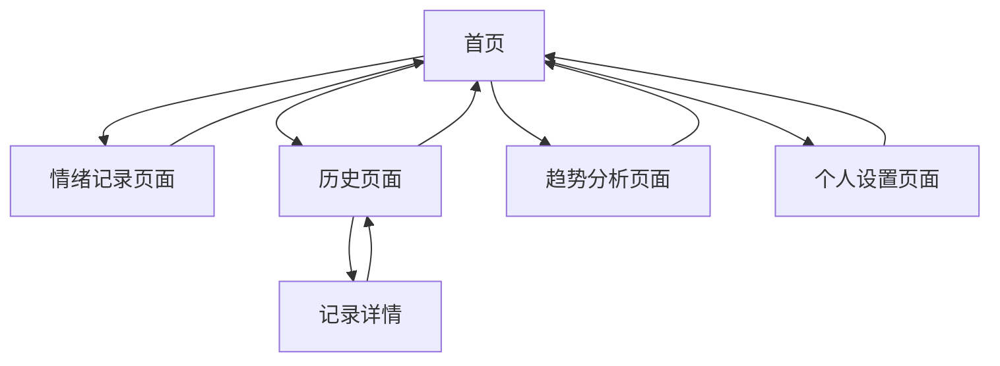

# 情绪记录疗愈应用 - 产品需求文档

## 1. Product Overview
一个专注于情绪记录和疗愈体验的 web 应用，帮助用户每日记录心情状态、撰写日记并上传多媒体内容。
通过数据可视化分析用户的情绪趋势，提供个人情绪健康洞察，营造温馨疗愈的数字空间。
目标是成为用户日常情绪管理和心理健康维护的贴心伙伴。

## 2. Core Features

### 2.1 User Roles
| Role | Registration Method | Core Permissions |
|------|---------------------|------------------|
| 注册用户 | 邮箱注册 + 密码 | 完整功能访问，个人数据隔离，云端数据存储 |

### 2.2 Feature Module
我们的情绪记录疗愈应用包含以下主要页面：
1. **登录注册页面**：用户注册、登录、密码重置
2. **首页**：欢迎界面、快速记录入口、今日心情状态展示、年度像素视图预览
3. **情绪记录页面**：心情选择器、情绪强度评分、活动标签、日记编辑器、照片/录音上传、语音转文字
4. **历史页面**：日历视图、年度像素视图、记录列表、详情查看、搜索筛选
5. **趋势分析页面**：情绪折线图、词云组件、情绪占比饼图、活动关联分析
6. **个人设置页面**：用户偏好设置、主题切换、数据导出(PDF)、隐私设置

### 2.3 Page Details

| Page Name | Module Name | Feature description |
|-----------|-------------|---------------------|
| 登录注册页面 | 用户注册 | 邮箱注册，密码强度验证，邮箱验证码确认 |
| 登录注册页面 | 用户登录 | 邮箱密码登录，记住登录状态，密码重置功能 |
| 首页 | 欢迎界面 | 展示个性化问候语和当前日期，营造疗愈氛围 |
| 首页 | 快速记录入口 | 提供快速进入情绪记录的按钮，支持一键开始记录 |
| 首页 | 今日状态展示 | 显示今日是否已记录情绪，展示最近的心情趋势 |
| 首页 | 年度像素预览 | 展示当月的情绪像素图，点击可进入完整年度视图 |
| 情绪记录页面 | 心情选择器 | 提供开心、难过、焦虑、平静、愤怒、兴奋、疲惫、激动等8种情绪选项 |
| 情绪记录页面 | 情绪强度评分 | 1-10分情绪强度滑块，支持精确记录情绪程度 |
| 情绪记录页面 | 活动标签系统 | 预设标签：工作、学习、运动、社交、娱乐、休息等，支持自定义标签 |
| 情绪记录页面 | 日记编辑器 | 支持富文本编辑，字数统计，自动保存草稿，语音输入 |
| 情绪记录页面 | 多媒体上传 | 支持照片上传（最大5MB）和录音功能（最长3分钟） |
| 情绪记录页面 | 语音转文字 | 录音实时转换为文字，支持中文识别，可编辑转换结果 |
| 历史页面 | 日历视图 | 月历展示，标记有记录的日期，支持快速跳转到指定日期 |
| 历史页面 | 年度像素视图 | 类似GitHub贡献图的年度情绪热力图，颜色深浅表示情绪强度 |
| 历史页面 | 记录列表 | 按时间倒序展示历史记录，支持按情绪、活动标签搜索和筛选 |
| 历史页面 | 详情查看 | 完整展示某日的情绪记录，包括文字、图片、录音、转换文字 |
| 趋势分析页面 | 情绪折线图 | 展示最近7天/30天/90天的情绪起伏，支持切换时间范围 |
| 趋势分析页面 | 词云组件 | 从日记和语音转文字中提取高频词汇，按频率调整字体大小和颜色 |
| 趋势分析页面 | 情绪占比饼图 | 统计各类情绪的出现频次，直观展示情绪分布 |
| 趋势分析页面 | 活动关联分析 | 分析不同活动与情绪的关联性，发现情绪触发因素 |
| 个人设置页面 | 用户偏好 | 设置主题色彩、字体大小、语音识别语言等个性化选项 |
| 个人设置页面 | 数据管理 | 支持PDF格式数据导出、数据备份、清空历史记录 |
| 个人设置页面 | 隐私设置 | 账户安全设置、数据隐私控制、注销账户 |

## 3. Core Process

**主要用户操作流程：**

1. **首次使用流程**：用户进入应用 → 查看预生成的示例数据 → 了解功能用法 → 开始首次情绪记录

2. **日常记录流程**：进入首页 → 点击快速记录 → 选择当前心情 → 撰写日记内容 → 可选上传照片或录音 → 保存记录

3. **历史回顾流程**：进入历史页面 → 通过日历或列表浏览 → 选择特定日期 → 查看完整记录详情

4. **趋势分析流程**：进入分析页面 → 查看情绪折线图了解趋势 → 通过词云发现关键词 → 查看饼图了解情绪分布

## 4. User Interface Design

### 4.1 Design Style
- **主色调**：奶白色 (#FEFEFE)、雾紫色 (#E6E0F8)、淡蓝色 (#E8F4FD)
- **辅助色**：柔和粉色 (#F8E8E8)、淡绿色 (#E8F8E8)
- **按钮样式**：圆角矩形，具有轻微阴影和果冻质感，支持柔和的按压动效
- **字体**：优雅的无衬线字体，主标题 24px，正文 16px，辅助文字 14px
- **布局风格**：卡片式设计，大量留白，柔和的分割线和渐变背景
- **图标风格**：线性图标配合柔和填充，使用圆润的边角设计
- **动效**：缓动函数使用 ease-out，过渡时间 0.3-0.5s，避免突兀的变化

### 4.2 Page Design Overview

| Page Name | Module Name | UI Elements |
|-----------|-------------|-------------|
| 首页 | 欢迎界面 | 渐变背景（奶白到淡蓝），居中的问候文字，柔和的呼吸动效 |
| 首页 | 快速记录入口 | 大号圆形按钮，雾紫色背景，白色图标，轻微浮起效果 |
| 情绪记录页面 | 心情选择器 | 圆形情绪按钮网格，选中时放大并改变颜色，柔和的弹性动画 |
| 情绪记录页面 | 日记编辑器 | 圆角文本框，淡蓝色边框，聚焦时柔和发光效果 |
| 历史页面 | 日历视图 | 卡片式月历，有记录的日期显示小圆点，选中日期高亮显示 |
| 趋势分析页面 | 情绪折线图 | 柔和的曲线，渐变填充，交互点显示详细信息 |
| 趋势分析页面 | 词云组件 | 彩色词汇云，字体大小和透明度随频率变化，支持点击交互 |
| 趋势分析页面 | 情绪占比饼图 | 柔和色彩的扇形，支持悬停显示百分比，平滑的展开动画 |

### 4.3 Responsiveness
应用采用移动优先的响应式设计，在手机端提供最佳体验，同时适配平板和桌面设备。支持触摸手势操作，包括滑动浏览历史记录、捏合缩放图表等交互方式。