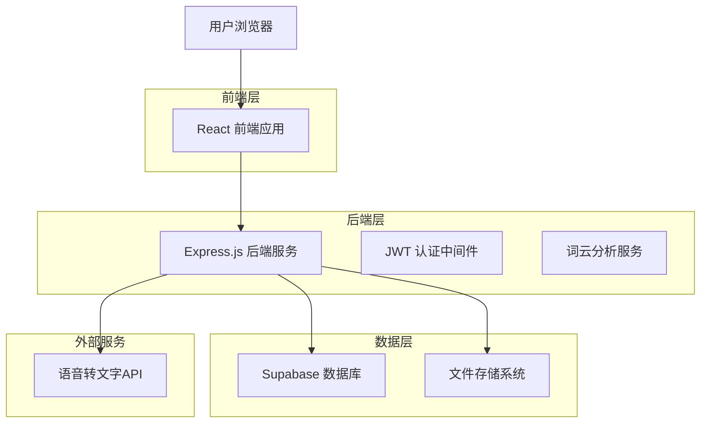
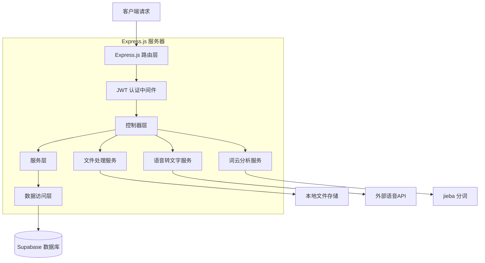
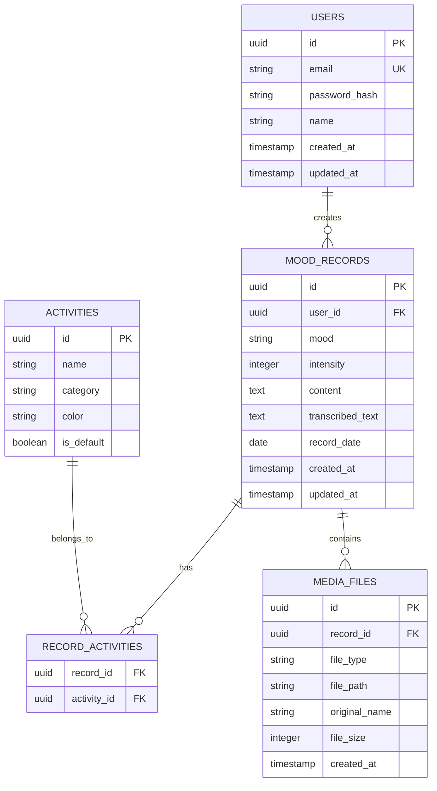

# 情绪记录疗愈应用 - 技术架构文档

## 1. Architecture design



## 2. Technology Description

- Frontend: React@18 + TypeScript + Tailwind CSS@3 + Vite
- Backend: Express.js@4 + TypeScript + JWT认证
- Database: Supabase (PostgreSQL)
- 状态管理: React Context + useState/useReducer
- 路由: React Router@6
- UI组件库: Headless UI + 自定义组件
- 图表库: Chart.js (折线图、饼图) + React-Wordcloud (词云)
- 语音转文字: 百度语音识别API / 讯飞语音API
- 文件存储: 本地文件系统 + Multer
- 词云分析: jieba (中文分词) + wordcloud
- 部署: 前端 Vercel/Netlify，后端 Railway/Render

## 3. Route definitions

| Route | Purpose |
|-------|----------|
| /login | 用户登录页面 |
| /register | 用户注册页面 |
| /home | 首页，显示今日状态和快速记录入口 |
| /record | 情绪记录页面，包含心情选择、日记编写、录音等功能 |
| /history | 历史记录页面，日历视图和记录列表 |
| /history/year | 年度像素视图页面 |
| /analytics | 趋势分析页面，图表和词云展示 |
| /settings | 个人设置页面，用户偏好和数据管理 |

## 4. API definitions

### 4.1 用户认证相关

用户注册
```
POST /api/auth/register
```

Request:
| Param Name | Param Type | isRequired | Description |
|------------|------------|------------|-------------|
| email | string | true | 用户邮箱 |
| password | string | true | 用户密码 |
| confirmPassword | string | true | 确认密码 |

Response:
| Param Name | Param Type | Description |
|------------|------------|-------------|
| success | boolean | 注册是否成功 |
| message | string | 响应消息 |
| token | string | JWT令牌 (成功时) |

用户登录
```
POST /api/auth/login
```

Request:
| Param Name | Param Type | isRequired | Description |
|------------|------------|------------|-------------|
| email | string | true | 用户邮箱 |
| password | string | true | 用户密码 |

Response:
| Param Name | Param Type | Description |
|------------|------------|-------------|
| success | boolean | 登录是否成功 |
| token | string | JWT令牌 |
| user | object | 用户信息 |

### 4.2 情绪记录相关

创建情绪记录
```
POST /api/records
```

Request:
| Param Name | Param Type | isRequired | Description |
|------------|------------|------------|-------------|
| mood | string | true | 情绪类型 |
| intensity | number | true | 情绪强度 (1-10) |
| content | string | false | 日记内容 |
| activities | array | false | 活动标签数组 |
| audioFile | file | false | 录音文件 |
| imageFile | file | false | 图片文件 |

Response:
| Param Name | Param Type | Description |
|------------|------------|-------------|
| success | boolean | 创建是否成功 |
| record | object | 创建的记录对象 |

获取用户记录
```
GET /api/records
```

Query Parameters:
| Param Name | Param Type | isRequired | Description |
|------------|------------|------------|-------------|
| startDate | string | false | 开始日期 |
| endDate | string | false | 结束日期 |
| mood | string | false | 筛选情绪类型 |
| page | number | false | 页码 |
| limit | number | false | 每页数量 |

### 4.3 语音转文字

语音转文字
```
POST /api/speech/transcribe
```

Request:
| Param Name | Param Type | isRequired | Description |
|------------|------------|------------|-------------|
| audioFile | file | true | 音频文件 |

Response:
| Param Name | Param Type | Description |
|------------|------------|-------------|
| success | boolean | 转换是否成功 |
| text | string | 转换后的文字 |

### 4.4 数据分析

获取情绪统计
```
GET /api/analytics/mood-stats
```

Query Parameters:
| Param Name | Param Type | isRequired | Description |
|------------|------------|------------|-------------|
| period | string | false | 统计周期 (week/month/year) |

Response:
| Param Name | Param Type | Description |
|------------|------------|-------------|
| moodDistribution | object | 情绪分布数据 |
| trendData | array | 趋势数据 |
| activityCorrelation | object | 活动关联分析 |

获取词云数据
```
GET /api/analytics/wordcloud
```

Query Parameters:
| Param Name | Param Type | isRequired | Description |
|------------|------------|------------|-------------|
| period | string | false | 统计周期 |

Response:
| Param Name | Param Type | Description |
|------------|------------|-------------|
| words | array | 词频数据数组 |

## 5. Server architecture diagram



## 6. Data model

### 6.1 Data model definition



### 6.2 Data Definition Language

用户表 (users)
```sql
-- 创建用户表
CREATE TABLE users (
    id UUID PRIMARY KEY DEFAULT gen_random_uuid(),
    email VARCHAR(255) UNIQUE NOT NULL,
    password_hash VARCHAR(255) NOT NULL,
    name VARCHAR(100) NOT NULL,
    created_at TIMESTAMP WITH TIME ZONE DEFAULT NOW(),
    updated_at TIMESTAMP WITH TIME ZONE DEFAULT NOW()
);

-- 创建索引
CREATE INDEX idx_users_email ON users(email);
```

情绪记录表 (mood_records)
```sql
-- 创建情绪记录表
CREATE TABLE mood_records (
    id UUID PRIMARY KEY DEFAULT gen_random_uuid(),
    user_id UUID NOT NULL REFERENCES users(id) ON DELETE CASCADE,
    mood VARCHAR(50) NOT NULL CHECK (mood IN ('开心', '难过', '焦虑', '平静', '愤怒', '兴奋', '疲惫', '激动')),
    intensity INTEGER NOT NULL CHECK (intensity >= 1 AND intensity <= 10),
    content TEXT,
    transcribed_text TEXT,
    record_date DATE NOT NULL,
    created_at TIMESTAMP WITH TIME ZONE DEFAULT NOW(),
    updated_at TIMESTAMP WITH TIME ZONE DEFAULT NOW()
);

-- 创建索引
CREATE INDEX idx_mood_records_user_id ON mood_records(user_id);
CREATE INDEX idx_mood_records_date ON mood_records(record_date DESC);
CREATE INDEX idx_mood_records_mood ON mood_records(mood);
```

活动表 (activities)
```sql
-- 创建活动表
CREATE TABLE activities (
    id UUID PRIMARY KEY DEFAULT gen_random_uuid(),
    name VARCHAR(100) NOT NULL,
    category VARCHAR(50) NOT NULL,
    color VARCHAR(7) DEFAULT '#6B7280',
    is_default BOOLEAN DEFAULT false
);

-- 插入默认活动
INSERT INTO activities (name, category, color, is_default) VALUES
('工作', '职业', '#EF4444', true),
('学习', '教育', '#3B82F6', true),
('运动', '健康', '#10B981', true),
('社交', '人际', '#F59E0B', true),
('娱乐', '休闲', '#8B5CF6', true),
('休息', '健康', '#6B7280', true),
('家务', '生活', '#EC4899', true),
('阅读', '教育', '#14B8A6', true);
```

记录活动关联表 (record_activities)
```sql
-- 创建记录活动关联表
CREATE TABLE record_activities (
    record_id UUID NOT NULL REFERENCES mood_records(id) ON DELETE CASCADE,
    activity_id UUID NOT NULL REFERENCES activities(id) ON DELETE CASCADE,
    PRIMARY KEY (record_id, activity_id)
);
```

媒体文件表 (media_files)
```sql
-- 创建媒体文件表
CREATE TABLE media_files (
    id UUID PRIMARY KEY DEFAULT gen_random_uuid(),
    record_id UUID NOT NULL REFERENCES mood_records(id) ON DELETE CASCADE,
    file_type VARCHAR(20) NOT NULL CHECK (file_type IN ('image', 'audio')),
    file_path VARCHAR(500) NOT NULL,
    original_name VARCHAR(255) NOT NULL,
    file_size INTEGER NOT NULL,
    created_at TIMESTAMP WITH TIME ZONE DEFAULT NOW()
);

-- 创建索引
CREATE INDEX idx_media_files_record_id ON media_files(record_id);
```